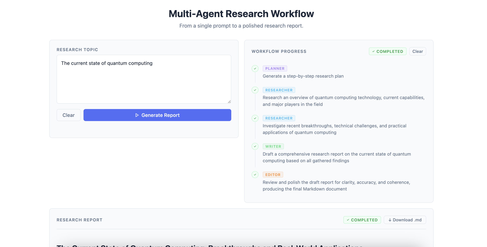

# Multi-Agent Research Workflow

A FastAPI web application that runs a multi-agent research workflow. Given a topic, it generates a comprehensive research report using a pipeline of specialized AI agents.



---

## Tech Stack

| | |
|---------|-------------|
| Backend | FastAPI, PostgreSQL, Docker |
| Frontend | HTML, CSS, JavaScript |
| LLM | Claude Sonnet |

---

## How it works

1. User submits a research prompt via the web UI
2. A **Planner Agent** breaks the topic into a sequence of steps, assigning each step to the appropriate agent:
   - **Researcher Agent** — searches the web, arXiv, and Wikipedia using external tools
   - **Writer Agent** — drafts a concise research report from gathered findings
   - **Editor Agent** — reviews and polishes the draft into the final report
3. A dispatch loop executes each step by routing to the assigned agent
4. Progress streams to the frontend in real time via SSE
5. The final report is persisted to the database and returned on request
6. The completed report is available to download

---

## Known Limitations

- **No cancellation** — once a report is started, it cannot be stopped; the workflow continues running even if the client disconnects
- **No retry on failure** — a single transient LLM or tool call error fails the entire workflow
- **No resume on failure** — failed reports must be resubmitted from scratch; no partial progress is preserved

---

## API Endpoints

| Method | Endpoint | Description |
|--------|----------|-------------|
| `GET` | `/` | Serves the web UI |
| `POST` | `/reports` | Accepts a research prompt and starts the multi-agent workflow to generate a report |
| `GET` | `/reports/{id}/stream` | Streams live workflow updates in real time via SSE |
| `GET` | `/reports/{id}` | Returns the completed report |

---

## Getting Started

### Prerequisites
- Docker and Docker Compose
- An Anthropic API key
- A Tavily API key

### Setup

**1. Set up your environment variables:**

```bash
cp .env.example .env
```

This creates a `.env` file from the template. Open it and add your API keys and database credentials.

**2. Build and start the app:**

```bash
make build
make up
```

The app will be available at [http://localhost:8000](http://localhost:8000).

### API Docs

- Swagger UI: [http://localhost:8000/docs](http://localhost:8000/docs)
- ReDoc: [http://localhost:8000/redoc](http://localhost:8000/redoc)

### Useful commands

| Command | Description |
|---------|-------------|
| `make build` | Build Docker images |
| `make up` | Start services |
| `make down` | Stop services |
| `make clean` | Stop services and remove volumes |
